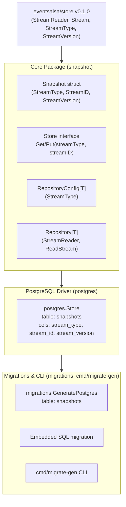

# Implementation Plan: Upgrade to `eventsalsa/store:v0.1.0` and Align Terminology (`Aggregate` -> `Stream`)

This plan covers upgrading `eventsalsa/snapshot` to use `github.com/eventsalsa/store:v0.1.0` and updating the terminology across the entire repository from `Aggregate` / `aggregate` to `Stream` / `stream`.

---

## Goal Description

The upstream library `github.com/eventsalsa/store` has released `v0.1.0`, deprecating aggregate-centric terminology in favor of stream-centric abstractions (`StreamReader`, `Stream`, `StreamType`, `StreamID`, `StreamVersion`, `stream_heads`). 

`eventsalsa/snapshot` must:
1. Upgrade dependency to `github.com/eventsalsa/store:v0.1.0`.
2. Align all public and internal interfaces, struct fields, error messages, SQL queries, DDL generators, examples, test suites, and documentation with the new `Stream` / `stream` conventions.

---

## User Review Required

> [!WARNING]
> **Breaking API & Database Changes**:
> 1. **Public Go API**:
>    - `snapshot.Snapshot`: Struct fields renamed (`AggregateType` -> `StreamType`, `AggregateID` -> `StreamID`, `AggregateVersion` -> `StreamVersion`).
>    - `snapshot.Store`: Interface method signatures renamed from `(aggregateType, aggregateID)` to `(streamType, streamID)`.
>    - `snapshot.RepositoryConfig[T]`: Config field renamed (`AggregateType` -> `StreamType`).
>    - `snapshot.NewRepository[T]`: First argument type changed from `store.AggregateStreamReader` to `store.StreamReader`.
> 2. **PostgreSQL Default Table & Column Names**:
>    - Default table name in `postgres.DefaultStoreConfig()` and `migrations.DefaultConfig()` updated from `aggregate_snapshots` to `snapshots`.
>    - Columns updated: `aggregate_type` -> `stream_type`, `aggregate_id` -> `stream_id`, `aggregate_version` -> `stream_version`.
>    - Index updated: `idx_aggregate_snapshots_schema_version` -> `idx_snapshots_schema_version`.

> [!IMPORTANT]
> **Branching & Commit Workflow**:
> Per project guidelines (`AGENTS.md` and `git-conventions`), all work will be executed on a dedicated branch (`feat/stream-terminology-and-store-v0.1.0`) with multiline conventional commits.

---

## Open Questions

> [!NOTE]
> **Default Table Name**:
> We propose updating the default snapshot table name from `aggregate_snapshots` to `snapshots` (mirroring `eventsalsa/store` which uses `events` for event persistence and `stream_heads` for version tracking). Custom table names remain fully configurable via `postgres.WithSnapshotsTable("...")` and `cmd/migrate-gen -snapshots-table="..."`.

---

## Proposed Changes



---

### Phase 1: Dependency Upgrade & Core Domain

#### [MODIFY] [go.mod](go.mod)
- Bump `github.com/eventsalsa/store` to `v0.1.0`.
- Run `go mod tidy`.

#### [MODIFY] [snapshot.go](snapshot.go)
- Rename fields in `Snapshot`:
  ```go
  type Snapshot struct {
      CreatedAt     time.Time
      StreamType    string
      StreamID      string
      Payload       []byte
      StreamVersion int64
      SchemaVersion int
  }
  ```
- Update `Store` interface methods:
  ```go
  type Store interface {
      Get(ctx context.Context, tx pgx.Tx, streamType, streamID string) (Snapshot, error)
      Put(ctx context.Context, tx pgx.Tx, snapshot *Snapshot) error
  }
  ```
- Update `RepositoryConfig[T]`:
  ```go
  type RepositoryConfig[T any] struct {
      Initializer   func(id string) T
      Apply         func(state T, event store.PersistedEvent) (T, error)
      Marshal       func(state T) ([]byte, error)
      Unmarshal     func(data []byte) (T, error)
      StreamType    string
      SchemaVersion int
  }
  ```
- Update `Repository[T]`:
  - Field `reader` becomes `store.StreamReader`.
  - `NewRepository` takes `store.StreamReader` and validates `config.StreamType != ""`.
  - `Load` calls `r.reader.ReadStream(ctx, tx, r.config.StreamType, id, fromVersion, nil)`.
  - Event loop iterates over `stream.Events[i].StreamVersion`.
  - `Save` constructs `Snapshot` with `StreamType`, `StreamID`, and `StreamVersion`.

#### [MODIFY] [postgres/store.go](postgres/store.go)
- Update default table in `DefaultStoreConfig()`: `SnapshotsTable: "snapshots"`.
- Update `Get` query and scan targets to `stream_type`, `stream_id`, `stream_version`.
- Update `Put` query to upsert into `snapshots` with columns `(stream_type, stream_id, stream_version, schema_version, payload, created_at)`.
- Update all logger debug keys (`aggregate_type` -> `stream_type`, `aggregate_id` -> `stream_id`, `aggregate_version` -> `stream_version`).

#### [MODIFY] [doc.go](doc.go)
- Replace all doc comments referring to aggregates with streams.

---

### Phase 2: Migrations & Tooling

#### [MODIFY] [migrations/generator.go](migrations/generator.go)
- Default `SnapshotsTable: "snapshots"`.
- Update generated DDL SQL to use `stream_type`, `stream_id`, `stream_version` and index `idx_%s_schema_version`.

#### [MODIFY] [migrations/20260621084951_init_snapshots.sql](migrations/20260621084951_init_snapshots.sql)
- Update the embedded SQL migration with table `snapshots` and stream columns.

#### [MODIFY] [migrations/doc.go](migrations/doc.go)
- Update package doc comment.

#### [MODIFY] [cmd/migrate-gen/main.go](cmd/migrate-gen/main.go)
- Update flag default: `snapshotsTable = flag.String("snapshots-table", "snapshots", "Name of snapshots table")`.
- Update CLI doc comments.

---

### Phase 3: Tests & Examples

#### [MODIFY] [integration_test/snapshot_integration_test.go](integration_test/snapshot_integration_test.go)
- Update DDL schemas in `setupPostgres` (`events`, `stream_heads`, `snapshots` with `stream_type`, `stream_id`, `stream_version`).
- Update `appendTestEvent` to use `store.Event{ StreamType: "User", StreamID: id, ... }`.
- Update `TestRawStoreGetPut` to test `StreamType`, `StreamID`, `StreamVersion`.
- Update `TestRepositoryRehydration` and `TestRepositoryErrorBoundaries` to test `StreamType` and `StreamVersion`.

#### [NEW] [snapshot_test.go](snapshot_test.go)
- Add mock-based unit tests for `Repository[T]` covering `Load`, `Save`, error boundaries, schema mismatch fallback, and empty initial states without requiring Docker/PostgreSQL.

#### [NEW] [migrations/generator_test.go](migrations/generator_test.go)
- Add unit tests for `GeneratePostgres` checking generated SQL syntax, custom table names, and embedded FS sanity.

#### [MODIFY] [examples/basic/main.go](examples/basic/main.go)
- Update schema DDLs (`events`, `stream_heads`, `snapshots`).
- Update domain usage to `StreamType: "User"`, `event.StreamVersion`, and stream terminology in logs/output.

---

### Phase 4: Documentation & Final Verification

#### [MODIFY] [README.md](README.md)
- Update all code snippets, DDL explanations, and conceptual guides to use `stream` instead of `aggregate`.

#### [MODIFY] [evolution-risk.md](evolution-risk.md)
- Update terminology from `aggregate` to `stream`.

---

## Verification Plan

### Automated Tests
Run the full verification suite defined in `Makefile`:
```bash
# Format and organize imports
make fmt

# Run unit tests and generate coverage report
make test-unit

# Run testcontainers PostgreSQL integration tests
make test-integration

# Run linter
make lint

# Run vulnerability scan
make govulncheck

# Run full project verification suite
make check
```

### Manual Verification
1. Test CLI generator:
   ```bash
   go run ./cmd/migrate-gen -output /tmp/test-migrations
   cat /tmp/test-migrations/*_init_snapshots.sql
   rm -rf /tmp/test-migrations
   ```
2. Build example program:
   ```bash
   go build -v ./examples/basic
   ```
