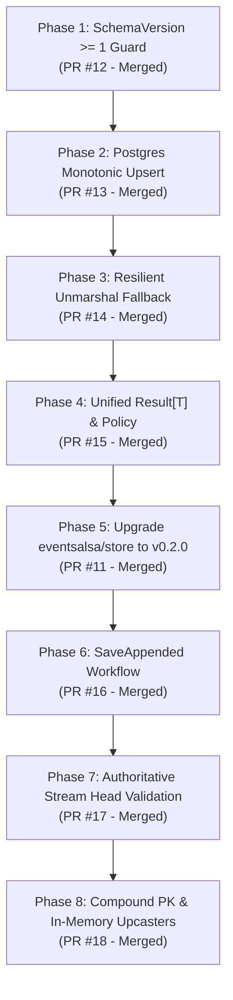

# 8-Phase Implementation Plan: `eventsalsa/snapshot` Production Hardening

This plan outlines the production hardening and ecosystem alignment of `eventsalsa/snapshot`.

---

## Progress & Roadmap Overview

| Phase | Description | Status | PR |
| :--- | :--- | :--- | :--- |
| **Phase 1** | Startup Configuration Invariant (`SchemaVersion >= 1`) | **Merged** | [#12](https://github.com/eventsalsa/snapshot/pull/12) |
| **Phase 2** | PostgreSQL Store Monotonicity Guard (`Put` upsert guard) | **Merged** | [#13](https://github.com/eventsalsa/snapshot/pull/13) |
| **Phase 3** | Resilient Snapshot Deserialization with Fallback | **Merged** | [#14](https://github.com/eventsalsa/snapshot/pull/14) |
| **Phase 4** | Unified `Result[T]` from `Load` & Policy Helpers | **Merged** | [#15](https://github.com/eventsalsa/snapshot/pull/15) |
| **Phase 5** | Intermediate Upgrade: `eventsalsa/store` to `v0.2.0` | **Merged** | [#11](https://github.com/eventsalsa/snapshot/pull/11) |
| **Phase 6** | Append-Safe Workflow (`SaveAppended`) & Domain Separation | **Merged** | [#16](https://github.com/eventsalsa/snapshot/pull/16) |
| **Phase 7** | Authoritative Stream Head & Version Boundary Validation | **Merged** | [#17](https://github.com/eventsalsa/snapshot/pull/17) |
| **Phase 8** | Rolling Deploy Multi-Version Support (Compound PK) & Upcasters | **Merged** | [#18](https://github.com/eventsalsa/snapshot/pull/18) |

---

## Detailed Phase Specifications

### [COMPLETED] Phase 1: Startup Invariant & Strict Configuration Validation
- Validated `config.SchemaVersion >= 1` in `NewRepository`.
- Rejected uninitialized zero-value configurations.
- Squash-merged into `main` in [PR #12](https://github.com/eventsalsa/snapshot/pull/12).

---

### [COMPLETED] Phase 2: PostgreSQL Store Monotonicity Guard
- Added `WHERE EXCLUDED.stream_version >= %s.stream_version` to `postgres.Store.Put`.
- Guaranteed that lagging or out-of-order writes cannot regress snapshot versions.
- Added direct test suite in `postgres/store_test.go`.
- Squash-merged into `main` in [PR #13](https://github.com/eventsalsa/snapshot/pull/13).

---

### [COMPLETED] Phase 3: Resilient Snapshot Deserialization with Fallback
- Updated `Repository.Load` to safely discard corrupted snapshot payloads and fall back to full stream replay from version 1.
- Added `FailOnCorruptSnapshot` and optional `Logger` to `RepositoryConfig`.
- Squash-merged into `main` in [PR #14](https://github.com/eventsalsa/snapshot/pull/14).

---

### [COMPLETED] Phase 4: Snapshot Result API & Policy Helpers
- Replaced dual `Load` / `LoadWithMeta` with single canonical `Load(ctx, tx, id) (Result[T], error)`.
- Introduced `Result[T]` exposing state, stream version, snapshot version, snapshot hit indicator, schema version, and delta events replayed.
- Added `Policy` function, `EveryNEvents(n)`, `Never()`, and `Result.ShouldSnapshot(policy, appendedCount)` helper.
- Squash-merged into `main` in [PR #15](https://github.com/eventsalsa/snapshot/pull/15).

---

### [COMPLETED] Phase 5: Intermediate Upgrade: `eventsalsa/store` to `v0.2.0`
- Upgraded `github.com/eventsalsa/store` from `v0.1.0` to `v0.2.0`.
- Aligned dependency tree and updated `jackc/pgx/v5` to `v5.11.0`.
- Squash-merged into `main` in [Dependabot PR #11](https://github.com/eventsalsa/snapshot/pull/11).

---

### [COMPLETED] Phase 6: Append-Safe Workflow & Pure Infrastructure Boundary
- Added `SaveAppended(ctx, tx, id, state, appendResult)` to fold newly appended events from `store.AppendResult` before saving snapshot.
- Refactored `examples/basic/main.go` and `README.md` to strictly separate infrastructure from domain logic.
- Squash-merged into `main` in [PR #16](https://github.com/eventsalsa/snapshot/pull/16).

---

### [COMPLETED] Phase 7: Authoritative Stream Head & Version Boundary Validation
- Added authoritative boundary checks during `Load` and `Save` against event log head.
- Invalidate snapshots claiming version ahead of event log with automatic full replay fallback.
- Invalidate orphan snapshots on empty streams with fallback to initial state.
- Reject `Save` attempts targeting non-existent stream versions.
- Squash-merged into `main` in [PR #17](https://github.com/eventsalsa/snapshot/pull/17).

---

### [COMPLETED] Phase 8: Rolling Deploy Multi-Version Support (Compound PK) & Upcasters
- Updated PostgreSQL table primary key to `(stream_type, stream_id, schema_version)`.
- Updated `Store.Get` to filter `WHERE schema_version <= maxSchemaVersion ORDER BY schema_version DESC LIMIT 1`.
- Added sequential in-memory `Upcasters map[int]Upcaster` to eliminate $O(N)$ replay spikes on schema version increments.
- Maintained safe fallback to full stream replay if upcaster is missing or fails.
- Added `SnapshotSchemaVersion` and `Upcasted` metadata fields to `Result[T]`.
- Established compound primary key directly in canonical initialization migration.
- Squash-merged into `main` in [PR #18](https://github.com/eventsalsa/snapshot/pull/18).
