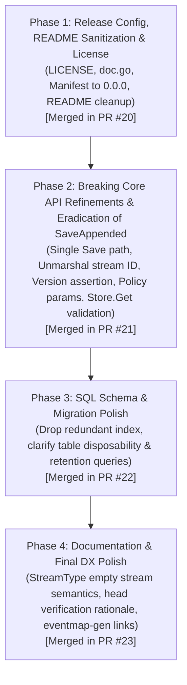

# Phased Implementation Plan: Audit Remediation & Initial v0.0.1 Release Preparation

## Goal Description

Address all open findings from [AUDIT_FINDINGS.md](AUDIT_FINDINGS.md) for `eventsalsa/snapshot`. Because `snapshot` is unreleased (no git tags, no installed base, no production consumers), we leverage this window to execute aggressive breaking improvements to the API and SQL schema.

In addition:
1. Reconfigure Release Please and its baseline manifest so the first release targets **`v0.0.1`** instead of `v0.1.0` (adjusting PR #1).
2. Remove all Release Please metadata and workflow sections from [README.md](README.md).
3. Completely eliminate the confusing dual save path (`SaveAppended`), standardizing on a single linear `Save(ctx, tx, id, version, state)` paired with `Result.ShouldSnapshot` and `RepositoryConfig.Version`.

---

## User Decisions & Review

- **Delivery Strategy**: Distinct PRs per phase (confirmed by user), squash-merged sequentially.
- **Architectural Simplification**: Deprecated and eradicated `SaveAppended` across the codebase, documentation, and examples.
- **Breaking API Changes**:
  - `RepositoryConfig[T].Unmarshal`: Signature updated to `func(streamID string, data []byte) (T, error)` to allow stream ID validation against decoded payloads (Item 6).
  - `Result[T].SchemaVersion`: Removed to eliminate duplicate state with `SnapshotHit` and `SnapshotSchemaVersion` (Item 8).
  - `Policy`: Parameter names clarified to `(streamVersionAtLoad, snapshotVersionAtLoad, appendedCount)` (Item 7).
  - `Store.Get`: Validates `maxSchemaVersion > 0` and rejects `<= 0` with an error, preventing accidental unversioned queries (Item 10).
  - `OnSnapshotRejected`: Added callback hook for observability across all fallback paths (Item 3).
  - Redundant Index: `idx_snapshots_schema_version` dropped from SQL migration generator and migration files (Item 14).

---

## Phased Execution Strategy

---

## Completed Phases

### Phase 1: Release Configuration, README Sanitization & Licensing
- Added Apache 2.0 [LICENSE](LICENSE) matching sibling `eventsalsa` repositories.
- Updated package overview example in [doc.go](doc.go).
- Reset [.release-please-manifest.json](.release-please-manifest.json) baseline to `"0.0.0"` and configured [release-please-config.json](release-please-config.json) with `"versioning": "always-bump-patch"` and `"initial-version": "0.0.1"`.
- Removed internal release pipeline documentation from [README.md](README.md).
- Merged via PR #20.

### Phase 2: Core API Refinements & Single Linear Save
- Completely eradicated `SaveAppended` in favor of a single linear `Save` workflow, eliminating pointer vs. value mutation ambiguities and double-event application hazards.
- Updated `RepositoryConfig[T].Unmarshal` signature to `func(streamID string, data []byte) (T, error)` to assert stream identity.
- Added optional `Version func(state T) int64` callback to `RepositoryConfig[T]` to fail fast on state/version divergence in `Save`.
- Renamed `Policy` parameter names to `(streamVersionAtLoad, snapshotVersionAtLoad, appendedCount)`.
- Removed redundant `Result.SchemaVersion`.
- Enforced `maxSchemaVersion > 0` validation in `postgres.Store.Get`.
- Added `OnSnapshotRejected` observability hook in `RepositoryConfig[T]`.
- Merged via PR #21.

### Phase 3: SQL Schema & Migration Polish
- Dropped redundant `idx_snapshots_schema_version` secondary index from [migrations/generator.go](migrations/generator.go) and [migrations/20260621084951_init_snapshots.sql](migrations/20260621084951_init_snapshots.sql).
- Documented snapshot table disposability and cache rehydration semantics.
- Documented retention cleanup query (`DELETE FROM snapshots WHERE schema_version < $1;`) and rollback tradeoffs.
- Merged via PR #22.

### Phase 4: Documentation & Developer Experience Polish
- Documented `StreamType` partitioning and empty stream semantics in `RepositoryConfig.StreamType`, `Repository.Load`, and [README.md](README.md).
- Documented the deliberate snapshot-at-head single-event verification read in `verifySnapshotInStream` and [README.md](README.md).
- Documented event log contiguity assumptions and expectations for physically pruned logs.
- Cross-linked `eventsalsa/store/cmd/eventmap-gen` in `RepositoryConfig.Apply` docstring and [README.md](README.md).
- Merged via PR #23.
