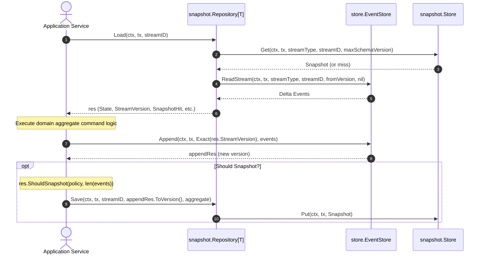

# Comprehensive Walkthrough: Audit Remediation & v0.0.1 Release Preparation

## Executive Summary
This document summarizes the full remediation of all audit findings from [AUDIT_FINDINGS.md](AUDIT_FINDINGS.md) across four sequential phases. While the library is unreleased (0 tags), breaking architectural improvements were made to establish a clean, production-grade foundation:
1. Reconfigured automated release management to target `v0.0.1`.
2. Eradicated the confusing dual save path (`SaveAppended`) in favor of a single linear `Save` workflow.
3. Hardened the core API with stream-aware deserialization, version assertions, strict store querying, and observability hooks.
4. Optimized the PostgreSQL migration schema by eliminating redundant indexes and formalizing table disposability and retention stories.
5. Polished documentation and developer ergonomics across the codebase.

---

## Architecture Evolution: Single Linear Save Workflow

Prior to remediation, `snapshot.Repository` offered both `Save` and `SaveAppended`. `SaveAppended` attempted to re-fold events into the aggregate state, causing confusion over whether pointer (`*T`) or value (`T`) states were mutated, risking double-application of events, and introducing mental overhead.

In Domain-Driven Design (DDD), state mutation and event application belong squarely in the domain aggregate layer, not the snapshot infrastructure. `SaveAppended` was completely removed, leaving a single, unambiguous workflow:

---

## Summary of All Implemented Changes

### Phase 1: Release Configuration & Legal Compliance (PR #20)
- **Apache 2.0 License**: Added [LICENSE](LICENSE) to align with `eventsalsa/store` and `eventsalsa/encryption` (Audit Item 1).
- **Package Overview Doc Fix**: Corrected stale example in [doc.go](doc.go) (Audit Item 2).
- **Release Please Calibration**:
  - Reset [.release-please-manifest.json](.release-please-manifest.json) baseline to `"0.0.0"`.
  - Configured [release-please-config.json](release-please-config.json) with `"versioning": "always-bump-patch"` and `"initial-version": "0.0.1"`, preventing unexpected jumps to `0.1.0`.
- **Clean Readme**: Stripped internal release automation documentation from [README.md](README.md).

### Phase 2: Core API Refinements & Eradication of `SaveAppended` (PR #21)
- **Eradicated `SaveAppended`**: Fully removed from [snapshot.go](snapshot.go), tests, and documentation (Audit Item 9).
- **Stream-Aware `Unmarshal`**: Updated signature to `func(streamID string, data []byte) (T, error)` so callers can assert that decoded state matches the target stream identifier (Audit Item 6).
- **Aggregate Version Parity**: Added optional `Version func(state T) int64` to `RepositoryConfig[T]`. When present, `Save` asserts `Version(state) == version`, failing fast if the aggregate's internal state diverges from the stream version (Audit Item 4).
- **Clear Policy Parameters**: Renamed `Policy` signature parameters to `(streamVersionAtLoad, snapshotVersionAtLoad, appendedCount)` to eliminate confusion when evaluating post-append snapshot rules (Audit Item 7).
- **Removed Duplicate Field**: Dropped redundant `Result.SchemaVersion` in favor of `Result.SnapshotSchemaVersion` and `Result.SnapshotHit` (Audit Item 8).
- **Strict Store Querying**: `postgres.Store.Get` enforces `maxSchemaVersion > 0`, rejecting `<= 0` with an error to prevent accidental unversioned queries from zero-value configs (Audit Item 10).
- **Observability Hook**: Added `OnSnapshotRejected func(ctx context.Context, streamID string, reason string, err error)` to `RepositoryConfig[T]`, triggering across all fallback scenarios (Audit Item 3).

### Phase 3: SQL Schema & Migration Polish (PR #22)
- **Dropped Redundant Secondary Index**: Removed `idx_snapshots_schema_version` from [migrations/generator.go](migrations/generator.go) and [migrations/20260621084951_init_snapshots.sql](migrations/20260621084951_init_snapshots.sql). The compound primary key `(stream_type, stream_id, schema_version)` already indexes and orders all queries (Audit Item 14).
- **Table Disposability Semantics**: Documented in [README.md](README.md) and DDL migration headers that `snapshots` contains purely derived, disposable cache data that can be dropped or truncated at any time without data loss (Audit Item 5).
- **Retention Story**: Documented the retention query (`DELETE FROM snapshots WHERE schema_version < $1;`) and explained the rollback tradeoffs during rolling multi-version deployments (Audit Item 15).

### Phase 4: Documentation & Developer Ergonomics (PR #23)
- **StreamType Partitioning**: Documented that mismatched `StreamType` between writers and `RepositoryConfig` returns initialized state at version 0 under empty stream semantics (Audit Item 11).
- **Snapshot-at-Head Verification**: Documented why snapshot-at-head deliberately performs a single-event read (`ReadStream(..., S, S)`) to ensure the snapshot version exists in the event log (Audit Item 12).
- **Event Log Contiguity Invariants**: Clarified why verification is safe to skip when delta events are present and documented expectations for systems that physically prune event logs (Audit Item 13).
- **Domain Codegen Link**: Cross-linked `eventsalsa/store/cmd/eventmap-gen` in `RepositoryConfig.Apply` and [README.md](README.md) for generating type-safe event mapping code (Audit Item 16).
- **Package Overview Polish**: Enriched [doc.go](doc.go) with upcaster and resilient cache details.

---

## Verification & Test Results

Across all phases, the validation suite was run and verified:
- **Code Formatting**: `make fmt` (`gofmt -w -s .` and `goimports`) executed cleanly.
- **Linting**: `golangci-lint run` passed with 0 issues.
- **Unit Tests**: `make test-unit` passed with 98.8% statement coverage across:
  - `TestRepository_Unmarshal_StreamIDValidation`
  - `TestRepository_VersionValidation`
  - `TestRepository_OnSnapshotRejected`
  - `TestStore_Get_Validation`
  - `TestSnapshotPolicy`
  - `TestRepository_Upcasters`
  - `TestRepository_Load` & `TestRepository_Load_Result`
  - `TestRepository_Save`
  - `TestGeneratePostgres_Default` & `TestGeneratePostgres_CustomTable`
- **Integration Tests**: `make test-integration` passed with real PostgreSQL testcontainers verifying multi-version coexistence, rolling deployments, monotonic guards, and store read/writes.
