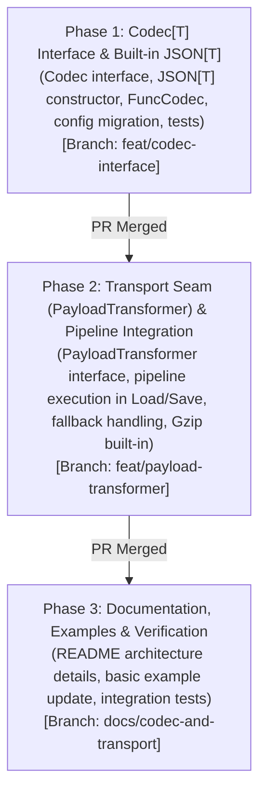

# Phased Implementation Plan: `snapshot.Codec` & Transport Seam (Option B)

## Goal Description

Introduce a clean separation of concerns for snapshot payload serialization and wire transformation as outlined in [CODEC_SEAM.md](CODEC_SEAM.md):
1. **`Codec[T]` Interface**: Unify `Marshal` and `Unmarshal` in `RepositoryConfig[T]` into a single cohesive interface, accompanied by a standard `snapshot.JSON[T]()` default codec and `snapshot.FuncCodec[T]` adapter.
2. **Transport Seam (`PayloadTransformer`)**: Provide an explicit outer boundary for raw byte manipulations (compression, envelope encryption, checksum framing) that operates strictly outside the schema versioning boundary.
3. **Pipeline Invariant**: Ensure that `Upcasters` always operate on uncompressed, decrypted plaintext at known schema versions, maintaining the contract:
   - **Write Path**: `State T` $\to$ `Codec.Encode` (plaintext @ current schema) $\to$ `Transformers.Transform` (stored bytes) $\to$ `Store.Put`
   - **Read Path**: `Store.Get` $\to$ `Transformers.Restore` (plaintext @ row schema) $\to$ `Upcasters` (plaintext @ current schema) $\to$ `Codec.Decode` $\to$ `State T`

---

## User Review Required

> [!IMPORTANT]
> **Breaking API Changes**:
> - `RepositoryConfig[T].Marshal` and `RepositoryConfig[T].Unmarshal` are replaced by `RepositoryConfig[T].Codec Codec[T]`.
> - Existing wiring sites migrate from two closure definitions to a single line: `Codec: snapshot.JSON[*MyState]()`.
> - `NewRepository` checks `config.Codec == nil` instead of validating `Marshal` and `Unmarshal`.

---

## Phased Execution Strategy

**Delivery Strategy**: **Distinct PRs per phase** (confirmed by user). Each phase is implemented on its own conventional branch from `main`, fully tested, committed, opened as a GitHub PR, and squash-merged into `main` before the next phase begins.



---

## Proposed Changes

### Phase 1: `Codec[T]` Interface & Built-in `JSON[T]`

#### [MODIFY] [snapshot.go](snapshot.go)
1. **Define `Codec[T]` interface and implementations**:
   ```go
   // Codec converts a state value to and from its payload bytes.
   type Codec[T any] interface {
       // Encode returns the serialized payload for state.
       Encode(state T) ([]byte, error)

       // Decode returns the state deserialized from payload. streamID is the target stream ID,
       // allowing implementations to validate that the decoded state belongs to the requested stream.
       Decode(streamID string, payload []byte) (T, error)
   }

   // jsonCodec implements Codec[T] using standard encoding/json.
   type jsonCodec[T any] struct{}

   func (j jsonCodec[T]) Encode(state T) ([]byte, error) {
       return json.Marshal(state)
   }

   func (j jsonCodec[T]) Decode(streamID string, payload []byte) (T, error) {
       var state T
       if err := json.Unmarshal(payload, &state); err != nil {
           return state, err
       }
       return state, nil
   }

   // JSON returns a default Codec backed by standard library encoding/json.
   // Transparently handles pointer and value types and honors json.Marshaler/json.Unmarshaler.
   func JSON[T any]() Codec[T] {
       return jsonCodec[T]{}
   }

   // FuncCodec creates a Codec from explicit encode and decode functions.
   func FuncCodec[T any](
       encode func(state T) ([]byte, error),
       decode func(streamID string, payload []byte) (T, error),
   ) Codec[T]
   ```

2. **Update `RepositoryConfig[T]`**:
   - Remove `Marshal func(state T) ([]byte, error)`
   - Remove `Unmarshal func(streamID string, data []byte) (T, error)`
   - Add `Codec Codec[T]`

3. **Update `NewRepository`**:
   - Replace nil checks for `config.Marshal` and `config.Unmarshal` with `if config.Codec == nil { return nil, fmt.Errorf("codec cannot be nil") }`.

4. **Update `Save` and `resolveSnapshot`**:
   - In `Save`: `payload, err := r.config.Codec.Encode(state)`
   - In `resolveSnapshot`: `state, err = r.config.Codec.Decode(id, payload)`

#### [MODIFY] [snapshot_test.go](snapshot_test.go), [integration_test/snapshot_integration_test.go](integration_test/snapshot_integration_test.go), [examples/basic/main.go](examples/basic/main.go)
- Migrate test setups and example wiring to `Codec: snapshot.JSON[*UserState]()` or `snapshot.FuncCodec`.
- Add unit tests for `JSON[T]` with pointer types, value types, and stream ID validation with custom codecs.

---

### Phase 2: Transport Seam (`PayloadTransformer`) & Pipeline Integration

#### [MODIFY] [snapshot.go](snapshot.go)
1. **Define `PayloadTransformer` interface**:
   ```go
   // PayloadTransformer transforms raw snapshot payload bytes on write and read paths.
   // Examples include wire compression, envelope encryption, or framing.
   // Transformers operate on the outer boundary; upcasters always operate on plaintext bytes.
   type PayloadTransformer interface {
       // Transform applies the transformation to plaintext payload bytes before storage (e.g., compress).
       Transform(ctx context.Context, payload []byte) ([]byte, error)

       // Restore reverses the transformation on stored bytes to produce plaintext bytes (e.g., decompress).
       Restore(ctx context.Context, payload []byte) ([]byte, error)
   }
   ```

2. **Add `Transformers []PayloadTransformer` to `RepositoryConfig[T]`**:
   - Nil elements in `Transformers` rejected at `NewRepository` validation.

3. **Integrate Pipeline into `Save`**:
   ```go
   payload, err := r.config.Codec.Encode(state)
   if err != nil {
       return fmt.Errorf("failed to encode snapshot: %w", err)
   }

   // Outbound: Apply transformers in forward order (0 .. N-1)
   for i, t := range r.config.Transformers {
       payload, err = t.Transform(ctx, payload)
       if err != nil {
           return fmt.Errorf("transformer %d failed to transform snapshot payload: %w", i, err)
       }
   }
   ```

4. **Integrate Pipeline into `resolveSnapshot`**:
   ```go
   payload := snap.Payload

   // Inbound: Restore transformers in reverse order (N-1 .. 0)
   for i := len(r.config.Transformers) - 1; i >= 0; i-- {
       var restoreErr error
       payload, restoreErr = r.config.Transformers[i].Restore(ctx, payload)
       if restoreErr != nil {
           if r.config.FailOnCorruptSnapshot {
               return zero, false, false, fmt.Errorf("transformer %d failed to restore snapshot payload: %w", i, restoreErr)
           }
           if r.config.Logger != nil {
               r.config.Logger.Error(ctx, "failed to restore snapshot payload; falling back to full stream replay",
                   "stream_type", r.config.StreamType,
                   "stream_id", id,
                   "error", restoreErr,
               )
           }
           if r.config.OnSnapshotRejected != nil {
               r.config.OnSnapshotRejected(ctx, id, fmt.Sprintf("transformer %d restore failed", i), restoreErr)
           }
           return zero, false, false, nil
       }
   }

   // Now payload is plaintext at snap.SchemaVersion -> proceeds to Upcasters -> Codec.Decode
   ```

5. **Implement Standard Gzip Transformer**:
   ```go
   // Gzip returns a PayloadTransformer that compresses payloads with gzip.
   func Gzip(level ...int) PayloadTransformer
   ```

#### [MODIFY] [snapshot_test.go](snapshot_test.go)
- Test pipeline ordering (multiple transformers compose in reverse order on restore).
- Test `Gzip` transformer round-trip.
- Test transformer failure triggering `OnSnapshotRejected` and fallback replay in resilient mode vs error in strict mode.
- Test interaction: `Gzip` + `Upcasters` + `Codec` (verifying upcasters receive uncompressed plaintext).

---

### Phase 3: Documentation, Examples & Verification

#### [MODIFY] [README.md](README.md)
- Update Quick Start and setup snippets with `Codec: snapshot.JSON[*UserState]()`.
- Add section `### Snapshot Compression & Payload Transformers` explaining:
  - The separation between `Codec`, `Upcasters`, and `Transformers`.
  - The pipeline diagram showing `Transform` and `Restore` outer ordering.
  - Built-in `snapshot.Gzip()` usage.
- Emphasize that upcasters always receive plaintext, ensuring compression and schema migrations compose without friction.

#### [MODIFY] [doc.go](doc.go)
- Highlight `Codec[T]` and `PayloadTransformer` in package overview.

#### [MODIFY] [examples/basic/main.go](examples/basic/main.go)
- Demonstrate `snapshot.JSON` and optionally show gzip compression.

#### [MODIFY] [integration_test/snapshot_integration_test.go](integration_test/snapshot_integration_test.go)
- Add integration test with PostgreSQL verifying real storage of gzipped snapshot payloads with rolling schema migrations and upcasting.

---

## Verification Plan

### Automated Tests
```bash
# Code formatting
make fmt

# Linting
golangci-lint run

# Unit tests
make test-unit

# Integration tests
make test-integration
```

### Specific Test Cases
1. `TestJSONCodec_PointerAndValueTypes`: Verifies `JSON[T]` works for both `*UserState` and `UserState`.
2. `TestCustomCodec_StreamIDValidation`: Verifies `Decode` receives `streamID` and can reject invalid payloads.
3. `TestPayloadTransformer_PipelineOrdering`: Verifies multi-transformer order ($0 \dots N-1$ write, $N-1 \dots 0$ read).
4. `TestGzipTransformer_RoundTrip`: Verifies compression and decompression ratio and payload fidelity.
5. `TestPayloadTransformer_UpcasterPlaintextGuarantee`: Verifies that intermediate upcasters receive uncompressed plaintext even when snapshots are compressed in storage.
6. `TestPayloadTransformer_CorruptRestoreFallback`: Verifies fallback to replay when transformer `Restore` fails.
